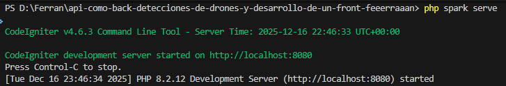
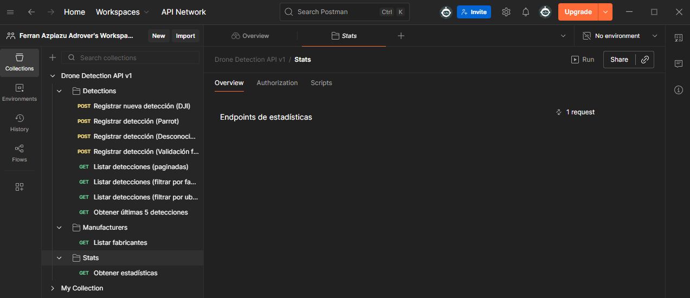
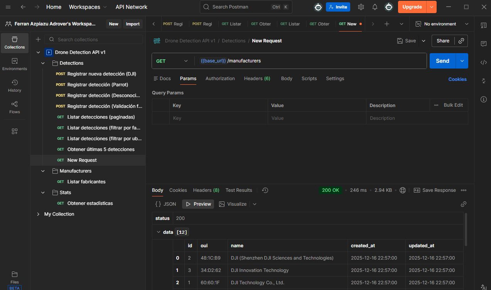
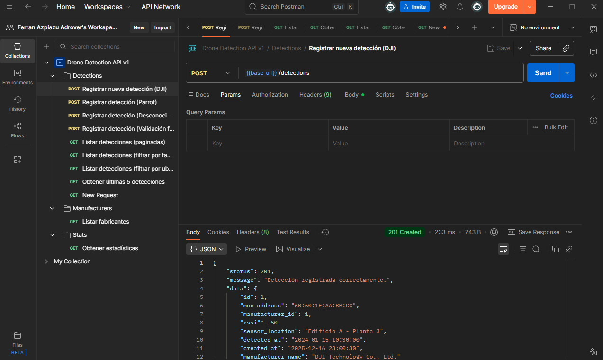
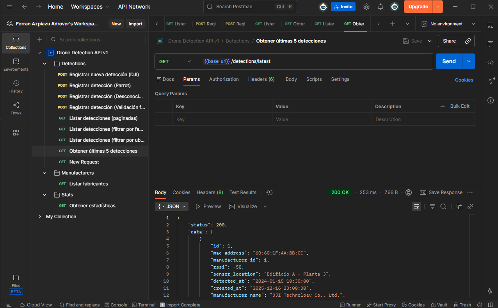

# API REST de Detección de Drones con CodeIgniter 4

> API REST que funciona como orquestador central para un sistema de detección de drones Wi-Fi. Basado en el artículo [Detección de Drones Wi-Fi](https://medium.com/@noko_kelevra/detecci%C3%B3n-de-drones-wi-fi-64b9cbdef2a6).

## 📋 Descripción

Esta API tiene dos responsabilidades principales:
1. **Recibir datos de sensores**: Los scripts Python de detección envían información sobre direcciones MAC detectadas.
2. **Servir datos al frontend**: Proporciona endpoints para un futuro panel de control/dashboard.

---

## 🛠️ Requisitos del Sistema

- PHP 8.1 o superior
- Composer
- Extensiones PHP: `intl`, `mbstring`, `sqlite3`

---

## 📦 Instalación

### 1. Clonar el repositorio
```bash
git clone <url-del-repositorio>
cd api-drones
```

### 2. Instalar dependencias
```bash
composer install
```

### 3. Configurar el entorno
```bash
cp env .env
```

Editar el archivo `.env` con la siguiente configuración (ajustar la ruta absoluta):
```ini
CI_ENVIRONMENT = development

app.baseURL = 'http://localhost:8080/'

database.default.hostname = 
database.default.database = /ruta/completa/al/proyecto/writable/database.sqlite
database.default.DBDriver = SQLite3
database.default.DBPrefix =
```

> **Nota**: SQLite requiere la ruta absoluta al archivo de base de datos.

### 4. Crear archivo de base de datos
```bash
touch writable/database.sqlite
```

### 5. Ejecutar migraciones
```bash
php spark migrate --all
```

### 6. Ejecutar seeders (poblar base de datos con fabricantes)
```bash
php spark db:seed ManufacturerSeeder
```

### 7. Iniciar el servidor de desarrollo
```bash
php spark serve
```

El servidor estará disponible en: `http://localhost:8080`

---

## 📊 Estructura de la Base de Datos

### Tabla `manufacturers`
| Columna | Tipo | Descripción |
|---------|------|-------------|
| id | INTEGER (PK) | Identificador único |
| oui | VARCHAR(8) | OUI del fabricante (ej: '60:60:1F') |
| name | VARCHAR(255) | Nombre del fabricante |
| created_at | DATETIME | Fecha de creación |
| updated_at | DATETIME | Fecha de actualización |

### Tabla `detections`
| Columna | Tipo | Descripción |
|---------|------|-------------|
| id | INTEGER (PK) | Identificador único |
| mac_address | VARCHAR(17) | Dirección MAC completa |
| manufacturer_id | INTEGER (FK) | Referencia a manufacturers (nullable) |
| rssi | INTEGER | Intensidad de la señal |
| sensor_location | VARCHAR(255) | Ubicación del sensor |
| detected_at | DATETIME | Fecha/hora de detección |
| created_at | DATETIME | Fecha de creación del registro |

---

## 🔌 Endpoints de la API

Base URL: `http://localhost:8080/api/v1`

### POST /detections
Registra una nueva detección de una dirección MAC.

**Request Body:**
```json
{
    "mac": "60:60:1F:AA:BB:CC",
    "rssi": -50,
    "sensor_location": "Edificio A - Planta 3",
    "timestamp": "2024-01-15T10:30:00Z"
}
```

**Response (201 Created):**
```json
{
    "status": 201,
    "message": "Detección registrada correctamente.",
    "data": {
        "id": 1,
        "mac_address": "60:60:1F:AA:BB:CC",
        "manufacturer_id": 1,
        "rssi": -50,
        "sensor_location": "Edificio A - Planta 3",
        "detected_at": "2024-01-15 10:30:00",
        "created_at": "2024-01-15 10:30:05",
        "manufacturer_name": "DJI Technology Co., Ltd."
    }
}
```

### GET /detections
Lista paginada de detecciones.

**Query Parameters:**
| Parámetro | Tipo | Opcional | Default | Descripción |
|-----------|------|----------|---------|-------------|
| page | int | Sí | 1 | Página actual |
| limit | int | Sí | 20 | Resultados por página (máx 100) |
| manufacturer_id | int | Sí | - | Filtrar por fabricante |
| location | string | Sí | - | Filtrar por ubicación del sensor |

**Response (200 OK):**
```json
{
    "status": 200,
    "data": [...],
    "pagination": {
        "current_page": 1,
        "per_page": 20,
        "total": 100,
        "total_pages": 5
    }
}
```

### GET /detections/latest
Obtiene las 5 detecciones más recientes.

**Response (200 OK):**
```json
{
    "status": 200,
    "data": [...]
}
```

### GET /manufacturers
Lista de todos los fabricantes de drones conocidos.

**Response (200 OK):**
```json
{
    "status": 200,
    "data": [
        {
            "id": 1,
            "oui": "60:60:1F",
            "name": "DJI Technology Co., Ltd.",
            "created_at": "2024-01-15 10:00:00",
            "updated_at": "2024-01-15 10:00:00"
        }
    ]
}
```

### GET /stats
Estadísticas para el dashboard.

**Response (200 OK):**
```json
{
    "status": 200,
    "data": {
        "total_detections": 1138,
        "known_drones_count": 820,
        "unknown_devices_count": 318,
        "top_manufacturer": "DJI Technology Co., Ltd."
    }
}
```

---

## 📷 Pruebas y Demostraciones

### Servidor Corriendo


### Colección Postman


### GET Manufacturers - Funcionando


### POST Detections - Funcionando


### GET Detections - Funcionando


---

## 📝 Fabricantes Precargados (Seeder)

El seeder incluye OUIs de los siguientes fabricantes:
- DJI Technology Co., Ltd. (varios OUIs)
- Parrot SA / Parrot Drones SAS
- Yuneec International
- Espressif Inc. (común en drones DIY)
- Raspberry Pi Foundation (drones DIY)

---

## 📮 Colección Postman

Importa el archivo `Drone_Detection_API.postman_collection.json` en Postman para probar todos los endpoints.

---

## ⚙️ Comandos Útiles

```bash
# Ejecutar migraciones
php spark migrate --all

# Revertir migraciones
php spark migrate:rollback

# Ejecutar seeder
php spark db:seed ManufacturerSeeder

# Iniciar servidor
php spark serve

# Ver rutas disponibles
php spark routes
```

---

## 🚀 Tecnologías Utilizadas

- **Framework**: CodeIgniter 4.6
- **Base de datos**: SQLite3
- **Lenguaje**: PHP 8.1+
- **Testing**: PHPUnit
- **Control de versiones**: Git

---

## 💡 Ejemplos de Uso Avanzado

### Crear múltiples detecciones
```bash
curl -X POST http://localhost:8080/api/v1/detections \
  -H "Content-Type: application/json" \
  -d '{
    "mac": "AA:BB:CC:DD:EE:FF",
    "rssi": -65,
    "sensor_location": "Parking Oeste",
    "timestamp": "2024-01-20T14:30:00Z"
  }'
```

### Filtrar detecciones por fabricante
```bash
curl "http://localhost:8080/api/v1/detections?manufacturer_id=1&page=1&limit=10"
```

### Filtrar por ubicación
```bash
curl "http://localhost:8080/api/v1/detections?location=Edificio%20A"
```

---

## 🐛 Troubleshooting

### Error: "database.sqlite not found"
- Verifica que la ruta en `.env` sea absoluta: `/ruta/completa/writable/database.sqlite`
- Crea el archivo manualmente: `touch writable/database.sqlite`

### Error: "SQLSTATE[HY000]: General error"
- Asegúrate de que la carpeta `writable/` tiene permisos de escritura
- En Windows: Haz clic derecho > Propiedades > Seguridad > Permisos completos

### La API no responde
- Verifica que el servidor está corriendo: `php spark serve`
- Comprueba que no hay otro servicio en el puerto 8080
- Revisa los logs: `tail -f writable/logs/log-*.php`

---

**Fecha de entrega**: Diciembre 2025
